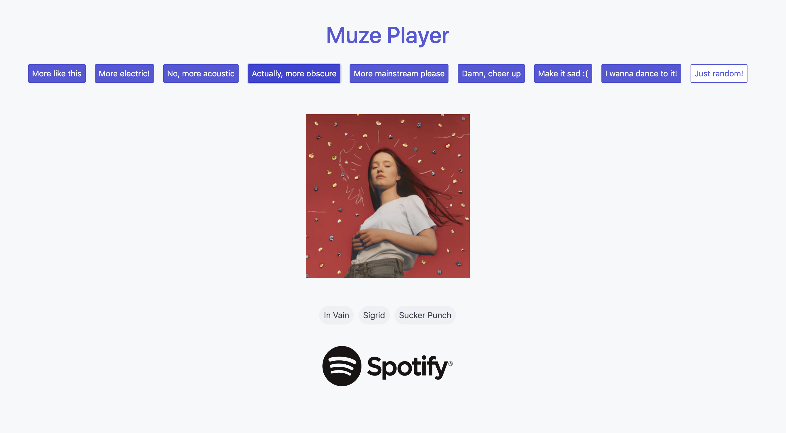
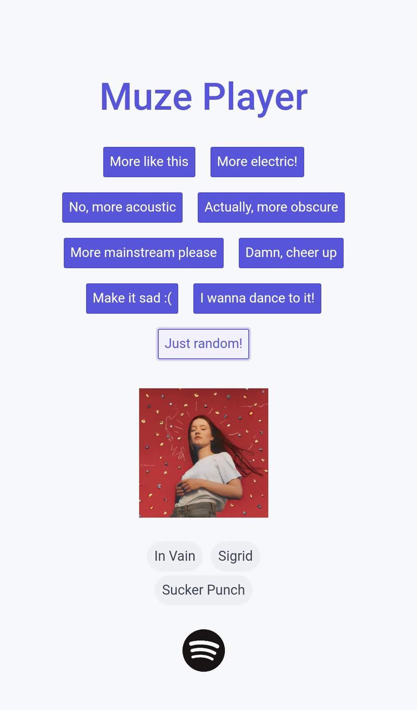

<div>
    
<!--      -->
</div>

## Overview
The [Muze Player](http://muze-player.herokuapp.com/) is an app for discovering and listening to music. This is its source code repo.

The app integrates with Spotify's [Web Playback SDK](https://developer.spotify.com/documentation/web-playback-sdk/) for streaming music and [Web API](https://developer.spotify.com/documentation/web-api/) for compiling music metadata.

The app consists of:
* A minimal web client that streams music, accepts raw text and voice input from the user, and communicates with the server via [web sockets](https://www.fullstackpython.com/websockets.html).
* A server app that contains a music knowledge API exposing info about musical entities (songs, artists, genres, relationships therein) that is internally organized using a semantic network.

## Music Knowledge API
The Music Knowledge Representation API exposes a collection of functions that encapsulate all SQL queries and logic relating to managing the database; through the API, callers may retrieve/add information from/to the database. A detailed description is available in [`design_docs/Music Knowledge Base Design Doc.pdf`](https://github.com/okjuan/muze/blob/master/design_docs/Music%20Knowledge%20Base%20Design%20Doc.pdf). This component was originally developed as part of a [distinct, collaborative project](https://github.com/MIR-Directed-Research/intelligent-music-recommender).

## Development
To run the app, you need [SQLite3](https://www.sqlite.org/download.html), [Python](https://www.python.org/downloads/) 3.5 or higher, and [pip](https://pypi.org/project/pip/). To actually use the app, you need a [Spotify premium account](https://www.spotify.com/us/premium/?utm_source=ca-en_brand_contextual_text&utm_medium=paidsearch&utm_campaign=alwayson_ucanz_ca_premiumbusiness_premium_brand+contextual+text+exact+ca-en+google&gclid=CjwKCAjwhbHlBRAMEiwAoDA3450erN_3OgzZ-r-D7byldS_fHtBu9qB4ezr_pEoPDQsepMWP1Q_7NxoCWvEQAvD_BwE&gclsrc=aw.ds) for streaming music.

Install Python packages:
```
pip install -r requirements.txt
```

### Running the App Locally
```
$ bash app/run-local.sh
```
The script:
* Temporarily points the client to localhost
* Opens an SSH tunnel to [Serveo](https://serveo.net/) to make the app running locally publicly available

*NOTE*: A Spotify premium account is necessary to stream music.

### Unit Tests
Run the tests from the project's root folder:
```
$ python run_tests.py
...
----------------------------------------------------------------------
Ran 56 tests in 0.943s

OK
```
